## Advertencia historica

Este documento conserva contexto tecnico de una etapa anterior. No debe usarse como guia operativa primaria sin contrastar con la documentacion vigente.

## Estado actual (vigente)

- Contratos publicos: solo /api/v2/**.
- Seguridad: permitAll solo en POST /api/v2/auth/login (+ health/info).
- Eventos: outbox operativo con estados PENDING/PROCESSED/FAILED.
- Compose principal: Producto/docker-compose.yaml (frontend + backend, sin postgres local).
- Estado del documento: historico
- Ultima verificacion: 2026-05-15
- Fuente de verdad: ver matriz canonica vigente y codigo fuente actual

# Diseño de Esquemas MongoDB para Sistema de Pañol

## Versión ajustada sin `audit_logs` en MongoDB

---

## 1. Propósito del documento

Este documento define el diseño recomendado para las colecciones de **MongoDB** dentro del sistema de pañol, considerando que la base de datos principal y transaccional del proyecto es **PostgreSQL**.

La decisión principal de esta versión es que **MongoDB no manejará auditoría formal de acciones de usuario**, porque esa responsabilidad ya está cubierta por la tabla relacional `audit_log` en PostgreSQL.

Por lo tanto, MongoDB se utilizará únicamente para:

```txt
MongoDB
├── inventory_movements
│   └── Historial de movimientos de inventario
│
├── loan_events
│   └── Timeline de cambios de estado de préstamos
│
├── notifications
│   └── Notificaciones internas para usuarios
│
├── stock_alerts
│   └── Alertas de stock bajo, crítico o inconsistente
│
└── system_events
    └── Eventos técnicos internos del sistema
```

La idea es mantener una separación clara de responsabilidades:

```txt
PostgreSQL = datos principales, relaciones, reglas, transacciones y auditoría formal.
MongoDB    = historial operativo, eventos, notificaciones, alertas y observabilidad técnica.
```

---

## 2. Contexto general de la arquitectura

El sistema de pañol trabaja con entidades principales como usuarios, roles, implementos, unidades individuales, stock, préstamos, detalles de préstamo, salas, categorías, ubicaciones y auditoría.

Estas entidades viven en PostgreSQL porque requieren:

- Integridad referencial.
- Relaciones entre tablas.
- Restricciones.
- Validaciones fuertes.
- Transacciones.
- Consistencia del estado actual.

MongoDB se utilizará como una base complementaria para registrar información que crece históricamente, que puede variar en estructura o que se consulta comúnmente por fechas, entidades relacionadas o eventos.

---

## 3. Separación de responsabilidades

### 3.1. PostgreSQL

PostgreSQL debe mantener el estado oficial del sistema.

Ejemplos:

```txt
PostgreSQL
├── user
├── role
├── implement
├── individual
├── stock
├── loan
├── loan_detail
├── loan_detail_individual
├── category
├── location
├── room
├── token_revocation
└── audit_log
```

En PostgreSQL deben quedar:

- Usuarios y roles.
- Implementos e inventario actual.
- Unidades individuales.
- Stock actual.
- Préstamos y sus estados actuales.
- Detalles de préstamo.
- Salas, categorías y ubicaciones.
- Revocación de tokens.
- Auditoría formal mediante `audit_log`.

---

### 3.2. MongoDB

MongoDB debe guardar información complementaria, histórica u operativa.

```txt
MongoDB
├── inventory_movements
├── loan_events
├── notifications
├── stock_alerts
└── system_events
```

En MongoDB deben quedar:

- Movimientos históricos de inventario.
- Timeline de cambios de estado de préstamos.
- Notificaciones internas por usuario.
- Alertas operativas de stock.
- Eventos técnicos internos del sistema.

MongoDB no debe reemplazar el estado principal de PostgreSQL.

---

## 4. Decisión importante: no usar `audit_logs` en MongoDB

En versiones anteriores del diseño podía considerarse una colección `audit_logs` en MongoDB. Sin embargo, para este proyecto no se recomienda incluirla, porque ya existe una tabla `audit_log` en PostgreSQL.

Esto evita duplicar responsabilidades.

La auditoría formal debe quedarse en PostgreSQL.

```txt
PostgreSQL
└── audit_log
    └── Auditoría formal de acciones funcionales del sistema
```

MongoDB, en cambio, debe enfocarse en eventos operativos y técnicos que no necesariamente representan auditoría formal.

---

## 5. Diferencia entre `audit_log` y `system_events`

Es importante no confundir la tabla `audit_log` de PostgreSQL con la colección `system_events` de MongoDB.

### 5.1. `audit_log` en PostgreSQL

Representa acciones funcionales o de negocio.

Responde preguntas como:

```txt
¿Quién hizo qué?
¿Sobre qué entidad lo hizo?
¿Cuándo ocurrió?
¿Qué usuario fue afectado?
```

Ejemplos:

```txt
- Un administrador creó un usuario.
- Un coordinador aprobó un préstamo.
- Un pañolero actualizó un implemento.
- Un usuario fue desactivado.
- Un préstamo fue rechazado.
```

### 5.2. `system_events` en MongoDB

Representa eventos técnicos internos del sistema.

Responde preguntas como:

```txt
¿Qué ocurrió técnicamente dentro del sistema?
¿Qué proceso falló?
¿Qué módulo generó un error?
Qué evento automático se ejecutó?
```

Ejemplos:

```txt
- Falló el envío de una notificación.
- No se pudo registrar un movimiento en MongoDB.
- Se ejecutó un proceso automático de revisión de stock.
- Se generó una alerta automáticamente.
- Ocurrió un error de sincronización entre PostgreSQL y MongoDB.
- Falló un proceso batch.
```

### 5.3. Comparación rápida

| Elemento | Ubicación | Propósito |
|---|---|---|
| `audit_log` | PostgreSQL | Auditoría formal de acciones funcionales |
| `system_events` | MongoDB | Observabilidad técnica interna |
| `inventory_movements` | MongoDB | Historial operativo de inventario |
| `loan_events` | MongoDB | Timeline de préstamos |
| `notifications` | MongoDB | Notificaciones internas |
| `stock_alerts` | MongoDB | Alertas operativas de stock |

---

## 6. Estrategia UUID-only

Como PostgreSQL usa UUID como identificador principal en sus tablas, MongoDB también debe referenciar esas entidades mediante UUID.

No se recomienda usar identificadores enteros como:

```js
user_id: 1
implement_id: 5
loan_id: 10
```

La forma correcta es usar:

```js
user_uuid: "550e8400-e29b-41d4-a716-446655440000"
implement_uuid: "550e8400-e29b-41d4-a716-446655440001"
loan_uuid: "550e8400-e29b-41d4-a716-446655440002"
```

### 6.1. Convención de nombres

Se recomienda usar la convención:

```txt
<entidad>_uuid
```

Ejemplos:

```txt
user_uuid
performed_by_uuid
changed_by_uuid
resolved_by_uuid
implement_uuid
individual_uuid
loan_uuid
loan_detail_uuid
stock_uuid
room_uuid
```

Esto permite que el modelo MongoDB sea coherente con el modelo relacional.

---

# 7. Colección `inventory_movements`

## 7.1. Propósito

La colección `inventory_movements` almacena el historial de movimientos de inventario.

Esta colección permite saber qué ocurrió con los implementos, cuándo ocurrió, qué cantidad fue afectada, quién realizó la acción y si el movimiento estuvo asociado a un préstamo.

Debe funcionar como una colección **append-only**, es decir, los documentos normalmente no se editan ni se eliminan. Cada movimiento queda registrado como evidencia histórica.

---

## 7.2. Casos de uso

Esta colección puede registrar:

```txt
- Entrada manual de stock.
- Salida manual de stock.
- Ajuste de inventario.
- Reserva de implementos.
- Entrega de préstamo.
- Devolución de préstamo.
- Cambio de estado de una unidad individual.
- Cambio de condición de una unidad individual.
- Registro de daño.
- Registro de pérdida.
- Corrección administrativa.
- Movimiento asociado a cambio de ubicación.
```

---

## 7.3. Esquema recomendado

```js
{
  _id: ObjectId,

  implement_uuid: UUID,
  individual_uuid: UUID | null,
  loan_uuid: UUID | null,
  loan_detail_uuid: UUID | null,

  action: String,
  movement_type: String,

  quantity: Number,

  previous_stock: Number | null,
  new_stock: Number | null,

  previous_status: String | null,
  new_status: String | null,

  previous_condition: String | null,
  new_condition: String | null,

  performed_by_uuid: UUID | null,
  source: String,

  notes: String | null,

  metadata: {
    reason: String | null,
    client_ip: String | null,
    user_agent: String | null,
    request_id: String | null
  },

  created_at: Date,
  schema_version: Number
}
```

---

## 7.4. Campos principales

### `_id`

Identificador propio de MongoDB.

### `implement_uuid`

Referencia lógica a `public.implement.uuid` en PostgreSQL.

Este campo debe ser obligatorio, porque todo movimiento de inventario debe estar asociado a un implemento.

### `individual_uuid`

Referencia lógica a `public.individual.uuid`.

Se usa cuando el movimiento afecta a una unidad física específica. Por ejemplo, un implemento reutilizable con código de activo propio.

Debe ser `null` cuando el movimiento afecta stock general o fungible.

### `loan_uuid`

Referencia lógica a `public.loan.uuid`.

Se usa cuando el movimiento está asociado a un préstamo.

### `loan_detail_uuid`

Referencia lógica a `public.loan_detail.uuid`.

Permite identificar qué detalle específico del préstamo generó el movimiento.

### `action`

Acción realizada.

Valores sugeridos:

```txt
manual_adjustment
stock_entry
stock_exit
reserved
delivered
returned
damaged
lost
stock_correction
location_changed
condition_changed
status_changed
```

### `movement_type`

Indica el efecto general del movimiento.

Valores sugeridos:

```txt
in       = entra stock o vuelve al inventario
out      = sale stock o queda prestado
neutral  = no cambia cantidad, pero cambia estado, condición o ubicación
```

### `quantity`

Cantidad afectada.

Para unidades individuales suele ser `1`. Para stock fungible puede ser cualquier número mayor a cero.

### `previous_stock` y `new_stock`

Permiten guardar el stock antes y después del movimiento.

Son útiles para reconstruir el historial de cambios.

### `previous_status` y `new_status`

Se usan cuando se modifica el estado de una unidad individual.

Ejemplo:

```txt
previous_status: "available"
new_status: "loaned"
```

### `previous_condition` y `new_condition`

Se usan cuando se modifica la condición física de una unidad.

Ejemplo:

```txt
previous_condition: "good"
new_condition: "damaged"
```

### `performed_by_uuid`

Referencia lógica al usuario que ejecutó la acción.

Puede ser `null` si fue generada automáticamente por el sistema.

### `source`

Origen del movimiento.

Valores sugeridos:

```txt
system
admin
loan_flow
stock_module
inventory_module
migration
```

### `notes`

Comentario opcional.

### `metadata`

Información técnica o contextual adicional.

### `created_at`

Fecha y hora del movimiento.

### `schema_version`

Versión del esquema.

Permite evolucionar la colección a futuro.

---

## 7.5. Ejemplo de documento

```js
{
  _id: ObjectId("665f1c4b9d3f2a0012a44e10"),

  implement_uuid: "b7b642ef-ec13-4d2d-bdf5-3e7d22d7a111",
  individual_uuid: null,
  loan_uuid: "3ab1a4e2-54b7-47c8-8f71-8c88ab91a888",
  loan_detail_uuid: "6fa8d3f0-cbee-4f38-84f7-7e72e2d6e111",

  action: "delivered",
  movement_type: "out",

  quantity: 2,

  previous_stock: 10,
  new_stock: 8,

  previous_status: null,
  new_status: null,

  previous_condition: null,
  new_condition: null,

  performed_by_uuid: "1ae82916-1280-4c9a-b52a-6f43fdc6b111",
  source: "loan_flow",

  notes: "Entrega asociada a préstamo aprobado.",

  metadata: {
    reason: "loan_delivery",
    client_ip: "192.168.1.20",
    user_agent: "Mozilla/5.0",
    request_id: "req-2026-001"
  },

  created_at: ISODate("2026-05-11T14:30:00Z"),
  schema_version: 1
}
```

---

## 7.6. Índices recomendados

```js
db.inventory_movements.createIndex({ implement_uuid: 1, created_at: -1 })
db.inventory_movements.createIndex({ individual_uuid: 1, created_at: -1 })
db.inventory_movements.createIndex({ loan_uuid: 1, created_at: -1 })
db.inventory_movements.createIndex({ performed_by_uuid: 1, created_at: -1 })
db.inventory_movements.createIndex({ created_at: -1 })
```

---

# 8. Colección `loan_events`

## 8.1. Propósito

La colección `loan_events` almacena el timeline de cambios de estado de los préstamos.

PostgreSQL mantiene el estado actual del préstamo en la tabla `loan`. MongoDB guarda la historia completa de cómo ese préstamo llegó a su estado actual.

Por ejemplo:

```txt
PostgreSQL dice:
El préstamo está entregado.

MongoDB permite ver:
El préstamo fue creado, luego aprobado, luego entregado.
```

---

## 8.2. Estructura recomendada

Se recomienda usar un documento por préstamo, con un arreglo embebido `status_history`.

```txt
loan_events
└── documento por préstamo
    └── status_history[]
```

Esto es coherente porque el historial de estado pertenece directamente al préstamo.

---

## 8.3. Esquema recomendado

```js
{
  _id: ObjectId,

  loan_uuid: UUID,

  requester_uuid: UUID | null,
  room_uuid: UUID | null,

  current_status: String,

  status_history: [
    {
      from_status: String | null,
      to_status: String,

      changed_at: Date,
      changed_by_uuid: UUID | null,

      comment: String | null,
      reason: String | null,

      metadata: {
        source: String | null,
        client_ip: String | null,
        user_agent: String | null,
        request_id: String | null
      }
    }
  ],

  created_at: Date,
  updated_at: Date,
  schema_version: Number
}
```

---

## 8.4. Campos principales

### `loan_uuid`

Referencia lógica a `public.loan.uuid`.

Debe ser único en esta colección.

### `requester_uuid`

Usuario que solicitó el préstamo.

Referencia lógica a `public.user.uuid`.

### `room_uuid`

Sala asociada al préstamo.

Referencia lógica a `public.room.uuid`.

### `current_status`

Estado actual del préstamo.

Debe reflejar el estado actual registrado en PostgreSQL, pero la fuente oficial sigue siendo la tabla `loan`.

Valores sugeridos:

```txt
pending
approved
rejected
cancelled
delivered
completed
```

### `status_history`

Arreglo de eventos de cambio de estado.

### `from_status`

Estado anterior.

Puede ser `null` cuando se registra la creación del préstamo.

### `to_status`

Nuevo estado del préstamo.

### `changed_at`

Fecha y hora del cambio.

### `changed_by_uuid`

Usuario que ejecutó el cambio.

Puede ser `null` si fue una acción automática del sistema.

### `comment`

Comentario funcional del evento.

### `reason`

Razón controlada del cambio.

Ejemplos:

```txt
loan_created
approved_by_coordinator
rejected_due_to_no_stock
cancelled_by_requester
delivered_by_staff
completed_after_return
```

---

## 8.5. Ejemplo de documento

```js
{
  _id: ObjectId("665f1d889d3f2a0012a44e20"),

  loan_uuid: "3ab1a4e2-54b7-47c8-8f71-8c88ab91a888",
  requester_uuid: "9128d2de-b9d6-4d54-8f2c-42f5f71eaaaa",
  room_uuid: "ea83ce2a-2468-405a-a299-9de14c89bbbb",

  current_status: "delivered",

  status_history: [
    {
      from_status: null,
      to_status: "pending",
      changed_at: ISODate("2026-05-11T12:00:00Z"),
      changed_by_uuid: "9128d2de-b9d6-4d54-8f2c-42f5f71eaaaa",
      comment: "Solicitud creada por docente.",
      reason: "loan_created",
      metadata: {
        source: "frontend",
        client_ip: "192.168.1.15",
        user_agent: "Mozilla/5.0",
        request_id: "req-2026-100"
      }
    },
    {
      from_status: "pending",
      to_status: "approved",
      changed_at: ISODate("2026-05-11T13:00:00Z"),
      changed_by_uuid: "1ae82916-1280-4c9a-b52a-6f43fdc6b111",
      comment: "Préstamo aprobado por coordinación.",
      reason: "approved_by_coordinator",
      metadata: {
        source: "admin_panel",
        client_ip: "192.168.1.20",
        user_agent: "Mozilla/5.0",
        request_id: "req-2026-101"
      }
    }
  ],

  created_at: ISODate("2026-05-11T12:00:00Z"),
  updated_at: ISODate("2026-05-11T13:00:00Z"),
  schema_version: 1
}
```

---

## 8.6. Índices recomendados

```js
db.loan_events.createIndex({ loan_uuid: 1 }, { unique: true })
db.loan_events.createIndex({ requester_uuid: 1, updated_at: -1 })
db.loan_events.createIndex({ current_status: 1, updated_at: -1 })
db.loan_events.createIndex({ "status_history.changed_at": -1 })
```

---

# 9. Colección `notifications`

## 9.1. Propósito

La colección `notifications` almacena notificaciones internas para usuarios del sistema.

Permite implementar una bandeja de avisos, alertas o mensajes funcionales dentro del sistema.

---

## 9.2. Casos de uso

Ejemplos:

```txt
- Tu préstamo fue aprobado.
- Tu préstamo fue rechazado.
- Tu préstamo está listo para retiro.
- Hay una solicitud pendiente de aprobación.
- Hay stock bajo de un implemento.
- Se completó un préstamo.
- Se registró una devolución pendiente.
```

---

## 9.3. Esquema recomendado

```js
{
  _id: ObjectId,

  user_uuid: UUID,

  type: String,
  title: String,
  message: String,

  read: Boolean,
  read_at: Date | null,

  priority: String,

  related_entity: {
    entity_type: String | null,
    entity_uuid: UUID | null
  },

  related_loan_uuid: UUID | null,
  related_implement_uuid: UUID | null,
  related_individual_uuid: UUID | null,

  action_url: String | null,

  metadata: {
    source: String | null,
    extra: Object | null
  },

  created_at: Date,
  expires_at: Date | null,
  schema_version: Number
}
```

---

## 9.4. Campos principales

### `user_uuid`

Usuario destinatario de la notificación.

Referencia lógica a `public.user.uuid`.

### `type`

Tipo de notificación.

Valores sugeridos:

```txt
loan_created
loan_approved
loan_rejected
loan_cancelled
loan_delivered
loan_completed
stock_low
stock_critical
system_message
pending_review
```

### `title`

Título corto de la notificación.

### `message`

Mensaje visible para el usuario.

### `read`

Indica si la notificación fue leída.

### `read_at`

Fecha de lectura.

Debe ser `null` si todavía no fue leída.

### `priority`

Nivel de prioridad.

Valores sugeridos:

```txt
low
normal
high
critical
```

### `related_entity`

Referencia genérica a una entidad relacionada.

Ejemplo:

```js
related_entity: {
  entity_type: "loan",
  entity_uuid: "3ab1a4e2-54b7-47c8-8f71-8c88ab91a888"
}
```

### `related_loan_uuid`

Referencia directa opcional a un préstamo.

### `related_implement_uuid`

Referencia directa opcional a un implemento.

### `related_individual_uuid`

Referencia directa opcional a una unidad individual.

### `action_url`

Ruta interna del frontend a la que puede llevar la notificación.

### `metadata`

Información adicional.

### `expires_at`

Fecha opcional de expiración.

Puede usarse con un índice TTL.

---

## 9.5. Ejemplo de documento

```js
{
  _id: ObjectId("665f1f3e9d3f2a0012a44e30"),

  user_uuid: "9128d2de-b9d6-4d54-8f2c-42f5f71eaaaa",

  type: "loan_approved",
  title: "Préstamo aprobado",
  message: "Tu préstamo fue aprobado y está listo para ser retirado en el pañol.",

  read: false,
  read_at: null,

  priority: "normal",

  related_entity: {
    entity_type: "loan",
    entity_uuid: "3ab1a4e2-54b7-47c8-8f71-8c88ab91a888"
  },

  related_loan_uuid: "3ab1a4e2-54b7-47c8-8f71-8c88ab91a888",
  related_implement_uuid: null,
  related_individual_uuid: null,

  action_url: "/loans/3ab1a4e2-54b7-47c8-8f71-8c88ab91a888",

  metadata: {
    source: "loan_flow",
    extra: {
      previous_status: "pending",
      new_status: "approved"
    }
  },

  created_at: ISODate("2026-05-11T13:05:00Z"),
  expires_at: null,
  schema_version: 1
}
```

---

## 9.6. Índices recomendados

```js
db.notifications.createIndex({ user_uuid: 1, read: 1, created_at: -1 })
db.notifications.createIndex({ user_uuid: 1, created_at: -1 })
db.notifications.createIndex({ related_loan_uuid: 1 }, { sparse: true })
db.notifications.createIndex({ related_implement_uuid: 1 }, { sparse: true })
db.notifications.createIndex({ expires_at: 1 }, { expireAfterSeconds: 0 })
```

---

# 10. Colección `stock_alerts`

## 10.1. Propósito

La colección `stock_alerts` almacena alertas de stock bajo, crítico o inconsistente.

PostgreSQL mantiene el estado actual del stock. MongoDB puede guardar el historial y estado operativo de las alertas generadas a partir de ese stock.

---

## 10.2. Casos de uso

```txt
- Alertas de bajo stock.
- Alertas de stock crítico.
- Alertas por exceso de unidades dañadas.
- Alertas por inconsistencias entre stock total, disponible, reservado y prestado.
- Historial de alertas resueltas.
- Dashboard para pañolero, coordinador o director.
```

---

## 10.3. Esquema recomendado

```js
{
  _id: ObjectId,

  implement_uuid: UUID,
  stock_uuid: UUID | null,

  alert_type: String,
  severity: String,

  current_stock: Number,
  min_stock: Number,

  available: Number,
  reserved: Number,
  loaned: Number,
  damaged: Number,

  message: String,

  resolved: Boolean,
  resolved_at: Date | null,
  resolved_by_uuid: UUID | null,
  resolution_notes: String | null,

  created_at: Date,
  updated_at: Date,
  schema_version: Number
}
```

---

## 10.4. Campos principales

### `implement_uuid`

Referencia lógica a `public.implement.uuid`.

### `stock_uuid`

Referencia lógica a `public.stock.uuid`.

Puede ser opcional si la alerta se quiere asociar principalmente al implemento.

### `alert_type`

Tipo de alerta.

Valores sugeridos:

```txt
low_stock
critical_stock
stock_inconsistency
damaged_excess
reserved_excess
loaned_excess
```

### `severity`

Nivel de gravedad.

Valores sugeridos:

```txt
info
warning
critical
```

### `current_stock`

Stock disponible o relevante al momento de generar la alerta.

### `min_stock`

Stock mínimo configurado.

### `available`, `reserved`, `loaned`, `damaged`

Snapshot del estado del stock al momento de generar la alerta.

Esto permite conservar contexto histórico aunque el stock cambie después.

### `message`

Mensaje descriptivo.

### `resolved`

Indica si la alerta fue resuelta.

### `resolved_at`

Fecha de resolución.

### `resolved_by_uuid`

Usuario que resolvió la alerta.

### `resolution_notes`

Comentario de resolución.

---

## 10.5. Ejemplo de documento

```js
{
  _id: ObjectId("665f20af9d3f2a0012a44e40"),

  implement_uuid: "b7b642ef-ec13-4d2d-bdf5-3e7d22d7a111",
  stock_uuid: "7888f158-e721-48d1-b73a-0a7be993cccc",

  alert_type: "low_stock",
  severity: "warning",

  current_stock: 3,
  min_stock: 5,

  available: 3,
  reserved: 2,
  loaned: 8,
  damaged: 1,

  message: "El implemento está por debajo del stock mínimo configurado.",

  resolved: false,
  resolved_at: null,
  resolved_by_uuid: null,
  resolution_notes: null,

  created_at: ISODate("2026-05-11T14:00:00Z"),
  updated_at: ISODate("2026-05-11T14:00:00Z"),
  schema_version: 1
}
```

---

## 10.6. Índices recomendados

```js
db.stock_alerts.createIndex({ implement_uuid: 1, resolved: 1, created_at: -1 })
db.stock_alerts.createIndex({ resolved: 1, severity: 1, created_at: -1 })
db.stock_alerts.createIndex({ alert_type: 1, created_at: -1 })
```

---

# 11. Colección `system_events`

## 11.1. Propósito

La colección `system_events` almacena eventos técnicos internos del sistema.

No es auditoría funcional. No reemplaza a `audit_log`.

Sirve para observabilidad, diagnóstico, seguimiento de errores técnicos y registro de procesos automáticos.

---

## 11.2. Casos de uso

```txt
- Falló el envío de una notificación.
- Falló el registro de un movimiento en MongoDB.
- Ocurrió timeout al escribir en MongoDB.
- Se ejecutó un proceso automático de revisión de stock.
- Se generó una alerta automáticamente.
- Falló una sincronización entre PostgreSQL y MongoDB.
- Un proceso batch terminó correctamente.
- Un proceso batch terminó con error.
- Se detectó una inconsistencia técnica.
```

---

## 11.3. Esquema recomendado

```js
{
  _id: ObjectId,

  event_type: String,
  level: String,

  module: String,

  message: String,

  related_entity: {
    entity_type: String | null,
    entity_uuid: UUID | null
  },

  error: {
    code: String | null,
    message: String | null,
    stack: String | null
  },

  metadata: Object | null,

  created_at: Date,
  schema_version: Number
}
```

---

## 11.4. Campos principales

### `event_type`

Tipo de evento técnico.

Valores sugeridos:

```txt
sync_error
notification_failed
job_executed
stock_alert_generated
mongo_write_failed
sql_transaction_completed
background_task_started
background_task_finished
background_task_failed
```

### `level`

Nivel del evento.

Valores sugeridos:

```txt
info
warning
error
critical
```

### `module`

Módulo que generó el evento.

Valores sugeridos:

```txt
inventory
loans
notifications
auth
users
stock
system
```

### `message`

Descripción legible del evento técnico.

### `related_entity`

Entidad relacionada con el evento, si aplica.

Ejemplo:

```js
related_entity: {
  entity_type: "loan",
  entity_uuid: "3ab1a4e2-54b7-47c8-8f71-8c88ab91a888"
}
```

### `error`

Información del error cuando el evento representa un fallo.

### `metadata`

Información adicional flexible.

Ejemplos:

```txt
- retry_count
- request_id
- job_name
- duration_ms
- source
- environment
```

### `created_at`

Fecha del evento técnico.

### `schema_version`

Versión del esquema.

---

## 11.5. Ejemplo de documento

```js
{
  _id: ObjectId("665f24149d3f2a0012a44e60"),

  event_type: "mongo_write_failed",
  level: "error",

  module: "inventory",

  message: "No se pudo registrar el movimiento de inventario en MongoDB después de confirmar la transacción en PostgreSQL.",

  related_entity: {
    entity_type: "implement",
    entity_uuid: "b7b642ef-ec13-4d2d-bdf5-3e7d22d7a111"
  },

  error: {
    code: "MONGO_TIMEOUT",
    message: "MongoDB operation timed out",
    stack: null
  },

  metadata: {
    operation: "register_inventory_movement",
    retry_count: 1,
    request_id: "req-2026-001",
    environment: "production"
  },

  created_at: ISODate("2026-05-11T15:30:00Z"),
  schema_version: 1
}
```

---

## 11.6. Índices recomendados

```js
db.system_events.createIndex({ level: 1, created_at: -1 })
db.system_events.createIndex({ module: 1, created_at: -1 })
db.system_events.createIndex({ event_type: 1, created_at: -1 })
db.system_events.createIndex({ created_at: -1 })
```

---

# 12. Flujo recomendado entre PostgreSQL y MongoDB

## 12.1. Regla principal

La regla recomendada es:

```txt
Primero se confirma la operación principal en PostgreSQL.
Después se registra el evento correspondiente en MongoDB.
```

Esto evita registrar eventos históricos de operaciones que finalmente fallaron en la base transaccional.

---

## 12.2. Ejemplo: entrega de préstamo

Cuando se entrega un préstamo, el flujo recomendado sería:

```txt
1. Validar préstamo en PostgreSQL.
2. Validar stock disponible.
3. Validar unidades individuales si corresponde.
4. Actualizar estado del préstamo en PostgreSQL.
5. Actualizar stock en PostgreSQL.
6. Actualizar estado de unidades individuales en PostgreSQL.
7. Confirmar transacción SQL.
8. Registrar movimiento en inventory_movements.
9. Registrar evento en loan_events.
10. Crear notificación en notifications si corresponde.
11. Registrar system_event si ocurre algún problema técnico secundario.
```

---

## 12.3. Ejemplo de distribución de responsabilidades

```txt
PostgreSQL:
- loan.status = delivered
- loan.delivered_at = now()
- stock.available disminuye
- stock.loaned aumenta
- individual.status cambia a loaned

MongoDB:
- inventory_movements registra la salida
- loan_events agrega evento de cambio de estado
- notifications avisa al usuario
- system_events registra errores técnicos si ocurren
```

---

## 12.4. Qué pasa si MongoDB falla

Puede ocurrir que PostgreSQL confirme correctamente una operación, pero MongoDB falle al registrar el evento.

Ejemplo:

```txt
El préstamo se entregó correctamente en PostgreSQL,
pero falló la escritura en inventory_movements.
```

En ese caso:

- No necesariamente se debe revertir la operación principal.
- Se debe registrar el error técnico.
- Se puede reintentar la escritura.
- Se puede enviar el evento a una cola.
- Se puede usar un patrón Outbox a futuro.

---

## 12.5. Patrón Outbox recomendado a futuro

Si el sistema crece, se recomienda usar el patrón **Transactional Outbox**.

La idea es:

```txt
1. Durante la transacción SQL, se guarda un evento pendiente en una tabla outbox.
2. Un proceso en segundo plano lee la outbox.
3. Ese proceso escribe el evento en MongoDB.
4. Si la escritura es exitosa, marca el evento como procesado.
5. Si falla, reintenta sin perder la operación original.
```

Esto mejora la confiabilidad entre PostgreSQL y MongoDB.

---

# 13. Validaciones recomendadas

## 13.1. Validar UUID

Todo campo terminado en `_uuid` debe validarse como UUID.

Ejemplos:

```txt
implement_uuid
individual_uuid
loan_uuid
loan_detail_uuid
user_uuid
performed_by_uuid
changed_by_uuid
resolved_by_uuid
```

---

## 13.2. Validar enums de dominio

No se recomienda aceptar strings completamente libres para campos importantes.

Deben validarse campos como:

```txt
action
movement_type
current_status
type
priority
alert_type
severity
event_type
level
module
```

---

## 13.3. Validar fechas

Las fechas deben guardarse como `Date` de MongoDB.

Campos comunes:

```txt
created_at
updated_at
changed_at
read_at
resolved_at
expires_at
```

---

## 13.4. Usar `schema_version`

Cada documento debe incluir:

```txt
schema_version: Number
```

Esto permite cambiar la estructura de los documentos en el futuro sin romper compatibilidad.

---

# 14. JSON Schema sugerido para `inventory_movements`

Ejemplo base de validación para MongoDB:

```js
db.createCollection("inventory_movements", {
  validator: {
    $jsonSchema: {
      bsonType: "object",
      required: [
        "implement_uuid",
        "action",
        "movement_type",
        "quantity",
        "source",
        "created_at",
        "schema_version"
      ],
      properties: {
        implement_uuid: {
          bsonType: "string",
          description: "UUID del implemento en PostgreSQL"
        },
        individual_uuid: {
          bsonType: ["string", "null"]
        },
        loan_uuid: {
          bsonType: ["string", "null"]
        },
        loan_detail_uuid: {
          bsonType: ["string", "null"]
        },
        action: {
          enum: [
            "manual_adjustment",
            "stock_entry",
            "stock_exit",
            "reserved",
            "delivered",
            "returned",
            "damaged",
            "lost",
            "stock_correction",
            "location_changed",
            "condition_changed",
            "status_changed"
          ]
        },
        movement_type: {
          enum: ["in", "out", "neutral"]
        },
        quantity: {
          bsonType: "int",
          minimum: 0
        },
        previous_stock: {
          bsonType: ["int", "null"]
        },
        new_stock: {
          bsonType: ["int", "null"]
        },
        previous_status: {
          bsonType: ["string", "null"]
        },
        new_status: {
          bsonType: ["string", "null"]
        },
        previous_condition: {
          bsonType: ["string", "null"]
        },
        new_condition: {
          bsonType: ["string", "null"]
        },
        performed_by_uuid: {
          bsonType: ["string", "null"]
        },
        source: {
          enum: ["system", "admin", "loan_flow", "stock_module", "inventory_module", "migration"]
        },
        notes: {
          bsonType: ["string", "null"]
        },
        metadata: {
          bsonType: ["object", "null"]
        },
        created_at: {
          bsonType: "date"
        },
        schema_version: {
          bsonType: "int"
        }
      }
    }
  }
})
```

---

# 15. Comandos de creación de índices

```js
// inventory_movements
db.inventory_movements.createIndex({ implement_uuid: 1, created_at: -1 })
db.inventory_movements.createIndex({ individual_uuid: 1, created_at: -1 })
db.inventory_movements.createIndex({ loan_uuid: 1, created_at: -1 })
db.inventory_movements.createIndex({ performed_by_uuid: 1, created_at: -1 })
db.inventory_movements.createIndex({ created_at: -1 })

// loan_events
db.loan_events.createIndex({ loan_uuid: 1 }, { unique: true })
db.loan_events.createIndex({ requester_uuid: 1, updated_at: -1 })
db.loan_events.createIndex({ current_status: 1, updated_at: -1 })
db.loan_events.createIndex({ "status_history.changed_at": -1 })

// notifications
db.notifications.createIndex({ user_uuid: 1, read: 1, created_at: -1 })
db.notifications.createIndex({ user_uuid: 1, created_at: -1 })
db.notifications.createIndex({ related_loan_uuid: 1 }, { sparse: true })
db.notifications.createIndex({ related_implement_uuid: 1 }, { sparse: true })
db.notifications.createIndex({ expires_at: 1 }, { expireAfterSeconds: 0 })

// stock_alerts
db.stock_alerts.createIndex({ implement_uuid: 1, resolved: 1, created_at: -1 })
db.stock_alerts.createIndex({ resolved: 1, severity: 1, created_at: -1 })
db.stock_alerts.createIndex({ alert_type: 1, created_at: -1 })

// system_events
db.system_events.createIndex({ level: 1, created_at: -1 })
db.system_events.createIndex({ module: 1, created_at: -1 })
db.system_events.createIndex({ event_type: 1, created_at: -1 })
db.system_events.createIndex({ created_at: -1 })
```

---

# 16. Priorización de implementación

No se recomienda implementar todas las colecciones al mismo tiempo.

La priorización sugerida es:

## 16.1. Fase 1 — Trazabilidad de inventario

```txt
inventory_movements
```

Prioridad: alta.

Motivo:

```txt
Es la colección más directamente relacionada con la operación central del pañol.
Permite saber qué pasó con el inventario, cuándo pasó y quién realizó la acción.
```

---

## 16.2. Fase 2 — Seguimiento de préstamos y comunicación

```txt
loan_events
notifications
```

Prioridad: media-alta.

Motivo:

```txt
Permiten mostrar historial de préstamos y avisar a usuarios sobre cambios relevantes.
```

---

## 16.3. Fase 3 — Control operativo

```txt
stock_alerts
```

Prioridad: media.

Motivo:

```txt
Permite detectar stock bajo, stock crítico o inconsistencias.
Sirve para dashboards del pañolero, coordinador o director.
```

---

## 16.4. Fase 4 — Observabilidad técnica

```txt
system_events
```

Prioridad: media.

Motivo:

```txt
Ayuda a diagnosticar errores técnicos, fallos de integración y problemas internos del sistema.
```

---

# 17. Diagrama conceptual

```txt
                         PostgreSQL
       ┌────────────────────────────────────────────┐
       │ user                                       │
       │ role                                       │
       │ implement                                  │
       │ individual                                 │
       │ stock                                      │
       │ loan                                       │
       │ loan_detail                                │
       │ loan_detail_individual                     │
       │ category                                   │
       │ location                                   │
       │ room                                       │
       │ audit_log                                  │
       └────────────────────────────────────────────┘
                         │
                         │ referencias UUID
                         â–¼
                         MongoDB
       ┌────────────────────────────────────────────┐
       │ inventory_movements                        │
       │ - implement_uuid                           │
       │ - individual_uuid                          │
       │ - loan_uuid                                │
       │ - loan_detail_uuid                         │
       │ - performed_by_uuid                        │
       ├────────────────────────────────────────────┤
       │ loan_events                                │
       │ - loan_uuid                                │
       │ - requester_uuid                           │
       │ - room_uuid                                │
       │ - status_history[]                         │
       ├────────────────────────────────────────────┤
       │ notifications                              │
       │ - user_uuid                                │
       │ - related_loan_uuid                        │
       │ - related_implement_uuid                   │
       │ - related_individual_uuid                  │
       ├────────────────────────────────────────────┤
       │ stock_alerts                               │
       │ - implement_uuid                           │
       │ - stock_uuid                               │
       │ - resolved_by_uuid                         │
       ├────────────────────────────────────────────┤
       │ system_events                              │
       │ - related_entity.entity_uuid               │
       └────────────────────────────────────────────┘
```

---

# 18. Mermaid recomendado para documentación

```mermaid
erDiagram

    POSTGRES_USER {
        uuid uuid PK
        string name
        string rut
        string email
        uuid role_uuid FK
    }

    POSTGRES_IMPLEMENT {
        uuid uuid PK
        string name
        string item_type
        uuid category_uuid FK
        uuid location_uuid FK
    }

    POSTGRES_INDIVIDUAL {
        uuid uuid PK
        string asset_code
        string status
        string condition
        uuid implement_uuid FK
    }

    POSTGRES_STOCK {
        uuid uuid PK
        int total_stock
        int available
        int reserved
        int loaned
        int damaged
        uuid implement_uuid FK
    }

    POSTGRES_LOAN {
        uuid uuid PK
        string status
        date scheduled_date
        time scheduled_time
        uuid requester_uuid FK
        uuid room_uuid FK
    }

    POSTGRES_LOAN_DETAIL {
        uuid uuid PK
        int requested_quantity
        int reserved_quantity
        int delivered_quantity
        uuid loan_uuid FK
        uuid implement_uuid FK
    }

    POSTGRES_AUDIT_LOG {
        uuid uuid PK
        string event
        object payload
        date created_at
        uuid actor_user_uuid FK
        uuid target_user_uuid FK
    }

    MONGO_INVENTORY_MOVEMENTS {
        objectId _id PK
        uuid implement_uuid
        uuid individual_uuid
        uuid loan_uuid
        uuid loan_detail_uuid
        string action
        string movement_type
        int quantity
        uuid performed_by_uuid
        date created_at
    }

    MONGO_LOAN_EVENTS {
        objectId _id PK
        uuid loan_uuid
        uuid requester_uuid
        uuid room_uuid
        string current_status
        array status_history
        date created_at
        date updated_at
    }

    MONGO_NOTIFICATIONS {
        objectId _id PK
        uuid user_uuid
        string type
        string title
        boolean read
        uuid related_loan_uuid
        uuid related_implement_uuid
        uuid related_individual_uuid
        date created_at
    }

    MONGO_STOCK_ALERTS {
        objectId _id PK
        uuid implement_uuid
        uuid stock_uuid
        string alert_type
        string severity
        boolean resolved
        uuid resolved_by_uuid
        date created_at
    }

    MONGO_SYSTEM_EVENTS {
        objectId _id PK
        string event_type
        string level
        string module
        object related_entity
        date created_at
    }

    POSTGRES_IMPLEMENT ||..o{ MONGO_INVENTORY_MOVEMENTS : "implement_uuid"
    POSTGRES_INDIVIDUAL ||..o{ MONGO_INVENTORY_MOVEMENTS : "individual_uuid"
    POSTGRES_LOAN ||..o{ MONGO_INVENTORY_MOVEMENTS : "loan_uuid"
    POSTGRES_LOAN_DETAIL ||..o{ MONGO_INVENTORY_MOVEMENTS : "loan_detail_uuid"
    POSTGRES_USER ||..o{ MONGO_INVENTORY_MOVEMENTS : "performed_by_uuid"

    POSTGRES_LOAN ||..|| MONGO_LOAN_EVENTS : "loan_uuid"
    POSTGRES_USER ||..o{ MONGO_LOAN_EVENTS : "requester_uuid"

    POSTGRES_USER ||..o{ MONGO_NOTIFICATIONS : "user_uuid"
    POSTGRES_LOAN ||..o{ MONGO_NOTIFICATIONS : "related_loan_uuid"
    POSTGRES_IMPLEMENT ||..o{ MONGO_NOTIFICATIONS : "related_implement_uuid"
    POSTGRES_INDIVIDUAL ||..o{ MONGO_NOTIFICATIONS : "related_individual_uuid"

    POSTGRES_IMPLEMENT ||..o{ MONGO_STOCK_ALERTS : "implement_uuid"
    POSTGRES_STOCK ||..o{ MONGO_STOCK_ALERTS : "stock_uuid"
    POSTGRES_USER ||..o{ MONGO_STOCK_ALERTS : "resolved_by_uuid"

    POSTGRES_USER ||..o{ POSTGRES_AUDIT_LOG : "actor_user_uuid"
    POSTGRES_USER ||..o{ POSTGRES_AUDIT_LOG : "target_user_uuid"
```



---

# 19. Resumen final

El diseño recomendado para MongoDB queda limitado a cinco colecciones:

```txt
MongoDB
├── inventory_movements
├── loan_events
├── notifications
├── stock_alerts
└── system_events
```

La colección `audit_logs` no se incluye en MongoDB porque la auditoría formal ya existe en PostgreSQL mediante `audit_log`.

La separación final queda así:

```txt
PostgreSQL:
- Estado actual.
- Entidades principales.
- Relaciones.
- Reglas de negocio.
- Transacciones.
- Auditoría formal.

MongoDB:
- Historial de movimientos.
- Timeline de préstamos.
- Notificaciones.
- Alertas de stock.
- Eventos técnicos internos.
```

Esta separación es más limpia, evita duplicar responsabilidades y mantiene MongoDB enfocado en lo que realmente aporta al sistema: flexibilidad, trazabilidad operativa, eventos históricos y observabilidad técnica.


